# 猎头招聘交付系统 — 产品说明手册

> **文档性质**：产品功能说明（What / Why），描述系统定位、业务对象、全部功能模块及能力边界。  
> **配套文档**：日常操作步骤见 `outputs/用户操作手册.md`；业务边界见 `outputs/猎头招聘交付系统-原型理解框架.md`。  
> **整理依据**：当前系统页面、`app.js` 导航与壳层、后端 API、以及 `findings.md` / `task_plan.md` 已确认规则。  
> **适用对象**：产品、实施、培训、客户验收、新成员上手。  
> **版本日期**：2026-07-19（已预留各模块截图占位）
> **截图目录**：`outputs/manual-screenshots/`（已由浏览器批量截取主图；可选补拍仍可按各节说明追加）

---

## 目录

1. [产品概述](#1-产品概述)
2. [系统边界](#2-系统边界)
3. [角色与权限总览](#3-角色与权限总览)
4. [核心业务对象](#4-核心业务对象)
5. [端到端交付主流程](#5-端到端交付主流程)
6. [功能模块详解](#6-功能模块详解)（含截图占位）
7. [候选人三维状态与关键规则](#7-候选人三维状态与关键规则)
8. [简历来源与隐式入库](#8-简历来源与隐式入库)
9. [附录：页面与导航对照表](#9-附录页面与导航对照表)

---

## 1. 产品概述

### 1.1 产品定位

**猎头招聘交付系统**是一套面向猎头公司内部使用的**岗位全生命周期交付管理系统**。

系统核心不是「看看板」，而是把招聘交付做成可跟踪、可协作、可审计的闭环：

```text
客户需求进入 → 项目/岗位拆分 → 简历池筛选 → 推荐与锁定
→ 面试推进与评价 → 入职确认 → 质保跟踪 → 统计复盘
```

### 1.2 目标用户

| 角色 | 典型职责 |
|------|----------|
| 超级管理员 | 账号体系、权限、标签口径、质保规则、审计与系统配置 |
| 组长 | 建客户/项目/岗位、分配岗位、看团队交付与绩效 |
| 操作员 | 检索简历、接受岗位、推荐候选人、写跟踪与评价、推进入职 |

### 1.3 两条业务主线

| 主线 | 方向 | 说明 |
|------|------|------|
| 需求进入 | 客户 → 猎头 | 甲方提出 JD；猎头在系统中结构化为客户 → 项目 → 岗位 |
| 交付推进 | 猎头 → 客户 | 从简历池筛选候选人，推荐、面试、评价，直至入职与质保 |

### 1.4 技术概要（阅读产品时可跳过）

- 前端：静态页面 + 共享壳层（导航、标题、权限菜单）
- 后端：FastAPI + PostgreSQL + SQLAlchemy
- 外部抓取数据落在独立 `recruit` schema；交付主数据在业务库中管理

---

## 2. 系统边界

### 2.1 系统负责

- 管理客户、项目、岗位、候选人、推荐、面试、评价、质保
- **消费**外部程序已下载/解析好的简历池数据
- 维护内部组织、角色、功能权限与数据范围
- 统计团队与项目交付情况
- 为 Recruit 抓取程序提供「待抓取岗位」配置，并查看每日抓取任务统计

### 2.2 系统不负责

- 上游招聘平台的爬虫实现与抓取策略本身
- 与智联等平台的直接账号对接（由外部 Recruit 程序承担）
- 简历来源生成策略（系统只读消费 + 业务侧手工导入）

---

## 3. 角色与权限总览

### 3.1 角色能力对照

| 能力 | 超级管理员 | 组长 | 操作员 |
|------|:----------:|:----:|:------:|
| 用户 / 角色 / 权限 / 数据权限 | ✅ | ❌ | ❌ |
| 标签字典 / 质保配置 / 操作日志 | ✅ | ❌ | ❌ |
| 新建客户、项目、岗位 | ✅ | ✅ | ❌ |
| 分配岗位给操作员 | ✅ | ✅ | ❌ |
| 简历池检索、导入、评价 | ✅ | ✅ | ✅ |
| 推荐 / 导出简历 | ✅ | ✅ | ✅（需已接受该岗位分配） |
| 统计数据范围 | 全部 | 授权范围 | 个人相关 |
| 平台岗位发布（Recruit） | 按菜单权限 | 按菜单权限 | 按菜单权限 |

### 3.2 权限模型要点

1. **功能权限**：按角色配置页面与操作（菜单动态显示）。
2. **数据权限**：可按公司 / 项目 / 岗位范围授权；与「岗位分配任务」联动。
3. **协作关键路径**：组长分配岗位 → 操作员在任务看板「接受」→ 才可对该岗位进行推荐等写操作。
4. **简历池**：检索对授权角色共享；同级流转有阻断规则，组长可穿透下属数据。
5. **单设备登录**：同一账号新登录会踢掉旧会话。

---

## 4. 核心业务对象

```text
客户(Company)
  └── 项目(Project)          ← 甲方某部门下的招聘包
        └── 岗位(Position)    ← 具体 JD / 招聘人数 / 薪资等
              └── 推荐(Recommendation)  ← 候选人与岗位的推进关系
                    ├── 面试跟踪 / 评价
                    └── 入职 → 质保

候选人(Candidate)  ← 简历池资源（可来自导入 / Recruit 映射 / 人工建档）
```

| 对象 | 含义 | 关键属性示例 |
|------|------|----------------|
| 客户 | 甲方公司 | 名称、联系人、电话、地址、合作周期、状态 |
| 项目 | 招聘包容器 | 所属客户、状态、等级、地点、周期 |
| 岗位 | 具体职位需求 | 紧急程度、招聘人数、薪资、地点、JD 描述、负责人 |
| 候选人 | 可匹配人才资源 | 基本信息、期望、来源、三维状态 |
| 推荐 | 候选人 × 岗位推进关系 | 推荐状态、漏斗分桶、推荐时间 |
| 评价 | 面试/推进过程留痕 | 轮次、等级、分值、内容、评价人 |
| 质保 | 入职后稳定期管理 | 入职日期、质保月数、剩余天数、状态 |
| 岗位分配任务 | 组长 → 操作员协作 | pending / accepted / rejected / revoked |
| 标签 / 热词 | 统一口径与快捷检索 | 字段映射、样式、启用状态 |

---

## 5. 端到端交付主流程

```text
登录
 → 建客户
 → 建项目 / 拆岗位（可 JD 智能解析预填）
 → 组长「分配权限」给操作员
 → 操作员在「任务看板」接受待办
 → 简历导入 或 Recruit 抓取入池 或 数据池检索（含 AI）
 → 「推荐至岗位」（自动锁定，每岗最多 10 人）
 → 「岗位候选人」页推进状态 + 写评价/跟踪
 → 候选人详情确认「已入职」
 → 「质保期管理」监控
 → 「统计管理」复盘
 → 「操作日志」审计（管理员）
```

---

## 6. 功能模块详解

以下按产品菜单与实际页面组织。每个模块包含：**用途**、**入口**、**功能介绍**、**关键说明**，以及 **📷 截图占位**。

### 截图填写约定

1. 截图统一放到 `outputs/manual-screenshots/`，文件名与各节「建议文件」一致。
2. 主图已嵌入各节；若你重拍覆盖同名文件，预览会自动更新。
3. 建议浏览器宽度 ≥ 1440；用演示数据；敏感信息打码。
4. 优先截「完整业务页首屏」；若某功能依赖弹窗/二级 Tab，按「拍摄说明」额外补一张。

---

### 6.1 登录与账号安全

| 项 | 说明 |
|----|------|
| **用途** | 身份认证与会话管理，保障账号安全 |
| **入口** | `login.html`；未登录访问业务页自动跳转 |

**功能介绍**

- 账号密码登录，登录成功进入数据看板
- Token 会话持久化；登出清除会话
- 单设备互踢：新登录使旧设备失效并提示
- 个人设置页可修改密码（忘记密码需联系管理员重置）

#### 📷 截图占位

| 项 | 说明 |
|----|------|
| **建议文件** | `outputs/manual-screenshots/06-01-login.png` |
| **拍摄说明** | 登录页全貌：左侧品牌区 + 右侧账号/密码/登录按钮；不要带浏览器地址栏也行，但页面主体要完整。 |
| **可选补拍** | `06-01-login-kicked.png`：被其他设备踢下线时的提示文案。 |


---

### 6.2 首页 / 数据看板

| 项 | 说明 |
|----|------|
| **用途** | 经营与交付概览，快速下钻到待办与明细 |
| **入口** | 侧栏「首页」→ `dashboard.html` |

**功能介绍**

| 能力 | 介绍 |
|------|------|
| 顶部 KPI | 求职者总数、客户公司数、总推荐数、待办岗位等；点击可跳转对应模块 |
| 推荐日历 | 按月查看「已推荐」人数；选日查看当日推荐明细（可按组长分组） |
| 月度看板 | 本月推荐、面试活动、已入职、本月新增岗位及明细列表 |
| 顶栏通知 | 铃铛进入任务与通知中心 |

**关键说明**：看板是管理展示层，不替代主流程操作；操作员的「待办岗位」主要对应待接受的岗位分配任务。

#### 📷 截图占位

| 项 | 说明 |
|----|------|
| **建议文件** | `outputs/manual-screenshots/06-02-dashboard.png` |
| **拍摄说明** | 首页首屏：顶部 KPI 卡 + 推荐日历或月度看板至少露出一块；侧栏「首页」为选中态。 |
| **可选补拍** | `06-02-dashboard-calendar.png`：点选某日后的推荐明细展开态。 |

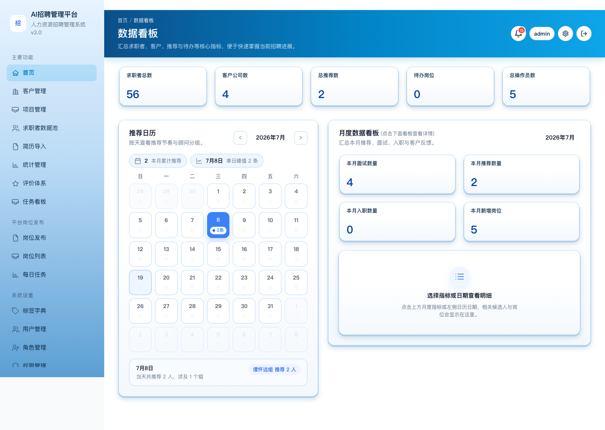

---

### 6.3 客户管理

| 项 | 说明 |
|----|------|
| **用途** | 管理甲方公司主数据，是项目与岗位的起点 |
| **入口** | 侧栏「客户管理」→ `customers.html` |

**功能介绍**

| 能力 | 介绍 |
|------|------|
| KPI 概览 | 客户公司数、进行中项目、累计交付、岗位总数等，支持下钻 |
| 客户列表 | 公司名称、联系人、电话、地址、项目数、岗位数、状态、操作 |
| 新建 / 编辑 / 删除 | 维护客户档案；删除会级联清理下游关联数据（需确认） |
| 状态切换 | 支持失效 / 恢复 |
| 结构预览 | 点击公司名浮层展示「项目 → 岗位」树，可进入岗位候选人页 |
| 跳转项目 | 按客户过滤进入项目管理 |

**表单要点**：客户名称、联系人、电话、邮箱、地址、合作周期、备注。

**关键说明**：没有客户不能建项目；创建/编辑通常需组长或管理员权限。

#### 📷 截图占位

| 项 | 说明 |
|----|------|
| **建议文件** | `outputs/manual-screenshots/06-03-customers.png` |
| **拍摄说明** | 客户管理列表页：顶部 KPI + 客户表格（含项目数/岗位数/操作列）。 |
| **可选补拍** | `06-03-customers-preview.png`：点击公司名后的「项目→岗位」浮层预览。 |

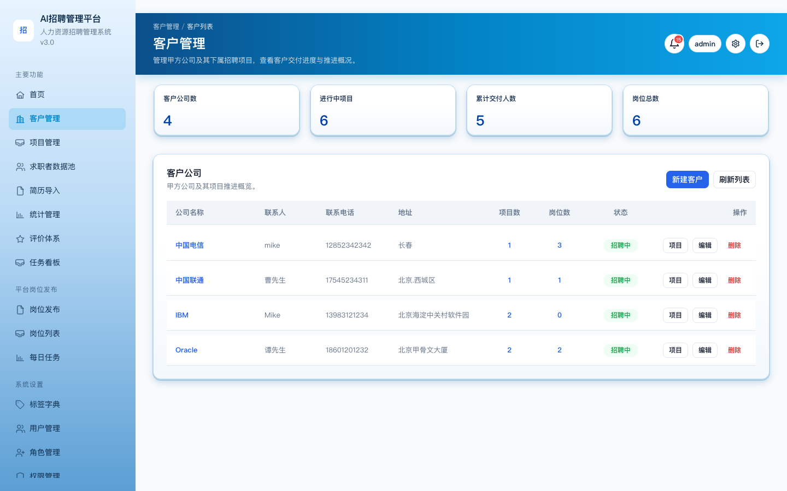

---

### 6.4 项目管理（含岗位管理）

| 项 | 说明 |
|----|------|
| **用途** | 以「招聘包」管理项目，并在项目下拆分岗位承接交付 |
| **入口** | 侧栏「项目管理」→ `projects.html`（双 Tab：项目列表 / 岗位列表） |

#### 6.4.1 项目列表

| 能力 | 介绍 |
|------|------|
| KPI | 项目总数、招聘中、招聘完毕、紧急岗位；点击可过滤 |
| 筛选 | 项目名称、所属公司、状态、等级、「我的项目」 |
| CRUD | 新建 / 编辑 / 删除 / 状态切换 |
| 列表信息 | 公司、项目名、状态、等级、招聘人数、地点、岗位数、创建时间 |

**项目状态**：招聘中 / 招聘完毕 / 招聘中止。  
**自动完结规则**：项目下每个岗位的「已入职人数 ≥ 招聘人数」时，项目变为「招聘完毕」。

#### 6.4.2 岗位列表

| 能力 | 介绍 |
|------|------|
| 筛选 | 岗位名、公司、项目、紧急程度、薪资范围 |
| 列表 | 公司、项目、岗位、紧急程度、招聘人数、薪资、地点、候选人漏斗（选中/未选/淘汰） |
| 新建岗位 | 填写 JD、人数、薪资、地点等 |
| JD 智能建岗 | 粘贴或上传 JD 文本（txt/pdf）→ LLM 解析预填 → 人工确认创建 |
| 分配权限 | 组长多选操作员，生成岗位分配待办 |
| 进入岗位候选人 | 点击岗位名进入 `position-candidates.html` |

**关键说明**：操作员不可创建岗位；推荐写操作依赖「已接受」的岗位分配。

#### 📷 截图占位

| 项 | 说明 |
|----|------|
| **建议文件** | `outputs/manual-screenshots/06-04-projects.png` |
| **拍摄说明** | 项目管理「项目列表」Tab：KPI + 筛选区 + 项目表格。 |
| **建议补拍** | `06-04-positions.png`：切换到「岗位列表」Tab，露出漏斗列与「分配权限」入口。 |
| **可选补拍** | `06-04-jd-parse.png`：JD 智能建岗弹窗（解析预填态）。 |

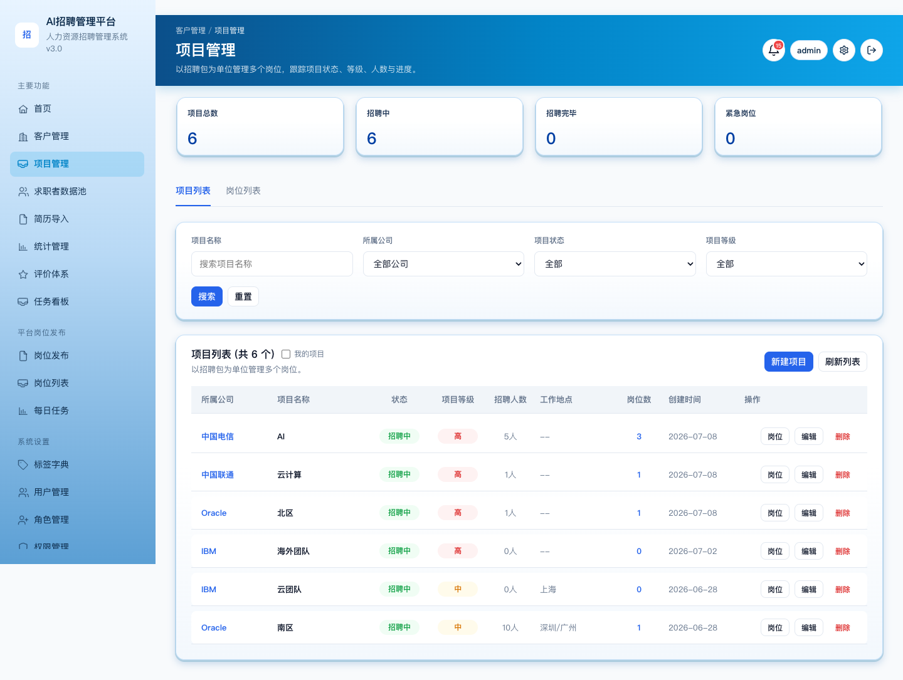
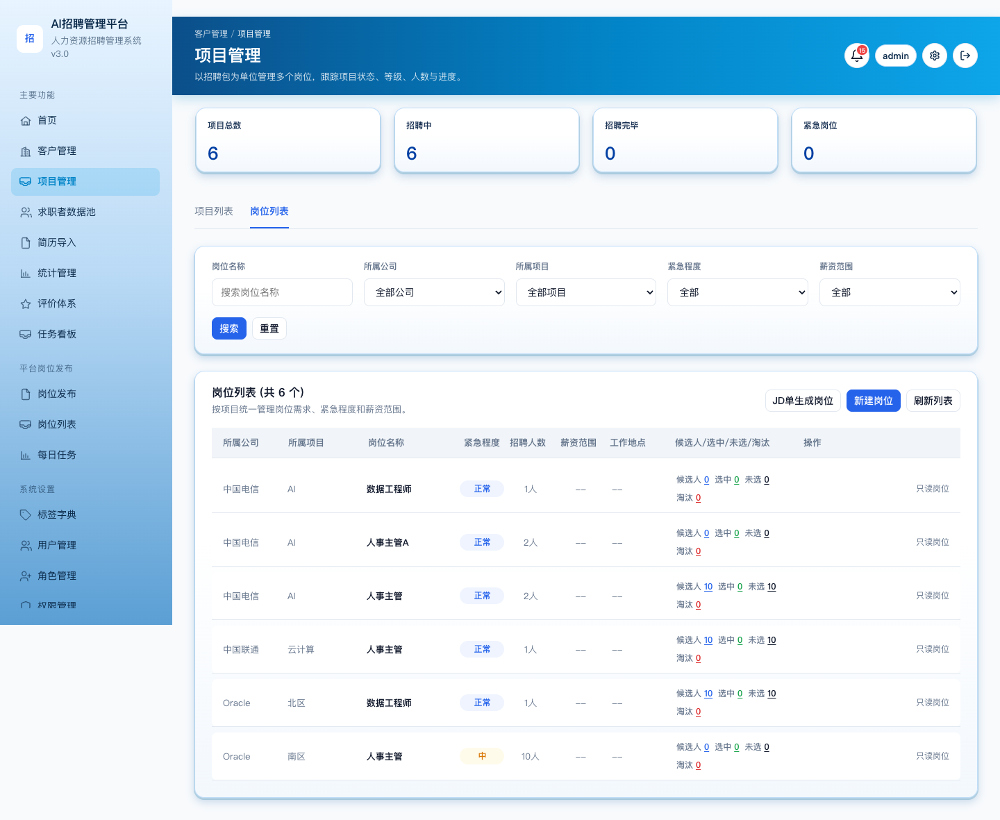

---

### 6.5 岗位候选人管理

| 项 | 说明 |
|----|------|
| **用途** | 单岗位交付工作台：推进推荐状态、写评价、导出简历 |
| **入口** | 项目管理 / 客户预览 → `position-candidates.html?position_id=…` |

**功能介绍**

| 能力 | 介绍 |
|------|------|
| 岗位摘要 | 紧急程度、招聘人数、薪资、候选人/已推荐/已入职计数、JD 面板 |
| 筛选 | 姓名、流程状态、漏斗分桶、匹配度 |
| 候选人列表 | 联系方式、当前职位、城市、学历、经验、推荐状态 |
| 添加候选人 | 跳回数据池并带上岗位上下文 |
| 行内展开 | 候选人跟踪 + 评价 |
| 状态推进 | 更新推荐状态；移除推荐以释放锁定名额 |
| 导出 | 单人 / 批量导出 PDF 简历 |
| 详情弹窗 | 与数据池共用完整候选人详情能力 |

**推荐状态流转（示意）**

```text
待推荐 → 已推荐 → 客户已收 / 客户未收 → 安排面试
       → 拒绝 / 淘汰 / 未录用 / 已入职
```

**关键规则**

- 每岗位同时锁定候选人上限 **10** 人
- **已入职**候选人不可移除推荐关系

#### 📷 截图占位

| 项 | 说明 |
|----|------|
| **建议文件** | `outputs/manual-screenshots/06-05-position-candidates.png` |
| **拍摄说明** | 某岗位候选人页：岗位摘要/JD + 候选人列表 + 推荐状态列。 |
| **可选补拍** | `06-05-position-candidates-expand.png`：展开行内跟踪/评价区域。 |

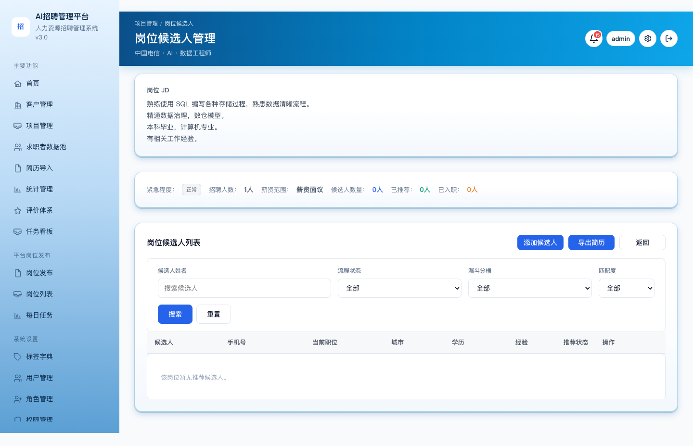

---

### 6.6 求职者数据池

| 项 | 说明 |
|----|------|
| **用途** | 猎头找人的核心工作台：检索、筛选、推荐、导出 |
| **入口** | 侧栏「求职者数据池」→ `candidates.html` |

**功能介绍**

| 能力 | 介绍 |
|------|------|
| KPI | 候选人总数、今日新增、已锁定；可点击过滤 |
| 关键词搜索 | 空格为 AND，逗号/竖线为 OR；优先期望岗位，其次经历字段 |
| 条件筛选 | 期望城市（省市区）、学历、年龄、经验、排序、状态（已推荐/未锁定/已锁定/自己锁定/未面试等） |
| 猜你想搜 | 标签字典中的热词快捷过滤 |
| AI 检索 | 粘贴 JD，在当前列表内做 LLM 匹配 Top5 |
| 搜索方案 | 保存常用搜索条件，便于复用 |
| 列表操作 | 跨页多选、批量推荐至岗位、批量导出 PDF、分页 |
| 去重展示 | 按 PDF 文件名 / 手机 / 邮箱 / 姓名等规则去重 |
| 外部简历 | Recruit 来源通过关联展示；实质性操作触发「触碰即入库」 |

**候选人详情弹窗（多页共用）**

- 基本信息编辑、备注
- 候选人跟踪（面试记录 CRUD、初筛标记）
- 面试评价（等级与 1–5 分联动）
- 入职状态开关（已入职 / 未入职及原因）
- 发送邮件、入职后随访
- 推荐到项目/岗位、继续推荐其他岗位
- PDF 导出（可带合同号、项目号、猎头职位等信息）

#### 📷 截图占位

| 项 | 说明 |
|----|------|
| **建议文件** | `outputs/manual-screenshots/06-06-candidates.png` |
| **拍摄说明** | 数据池首屏：KPI + 搜索/筛选区 +「猜你想搜」+ 候选人列表与操作列。 |
| **建议补拍** | `06-06-candidates-detail.png`：候选人详情弹窗（基本信息 + 跟踪/评价 Tab 可见）。 |
| **可选补拍** | `06-06-candidates-ai-search.png`：AI 检索结果 Top5 展示态。 |

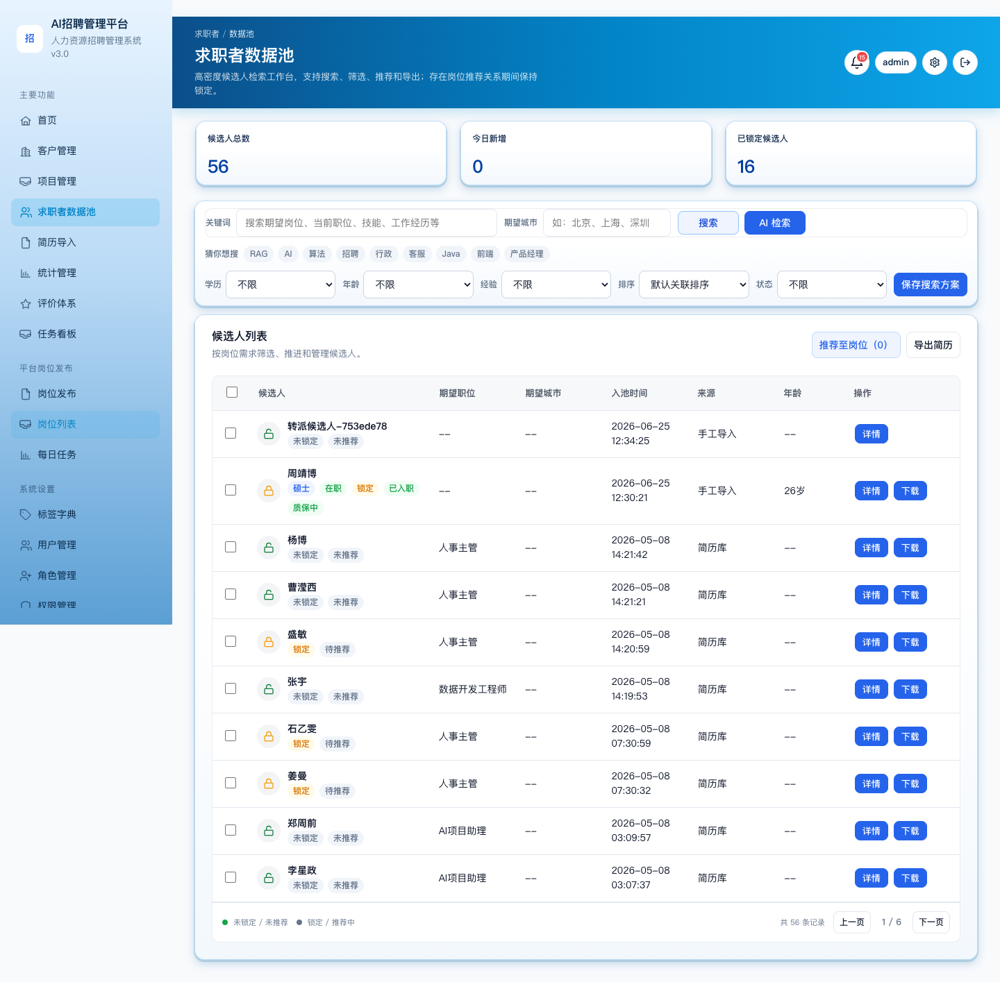
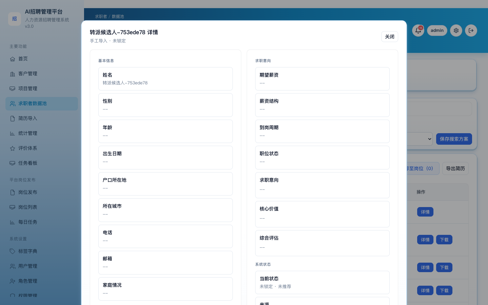

---

### 6.7 简历导入

| 项 | 说明 |
|----|------|
| **用途** | 手工补录 PDF 简历进入业务池 |
| **入口** | 侧栏「简历导入」→ `import.html` |

**功能介绍**

| 能力 | 介绍 |
|------|------|
| 单份导入 | 上传一份 PDF 解析入库 |
| 批量导入 | 多文件批量处理 |
| 导入时间线 | 查看成功 / 失败 / 待复核记录 |
| 同名处理 | 同名候选人进入**待复核**，不静默覆盖 |
| 联动 | 成功后可在数据池检索；写入操作日志与站内通知 |

**说明**：平台抓取主链路见「平台岗位发布」；本模块侧重人工补录。

#### 📷 截图占位

| 项 | 说明 |
|----|------|
| **建议文件** | `outputs/manual-screenshots/06-07-import.png` |
| **拍摄说明** | 简历导入页：上传入口（单份/批量）+ 导入记录时间线（最好含成功/失败或待复核样例）。 |

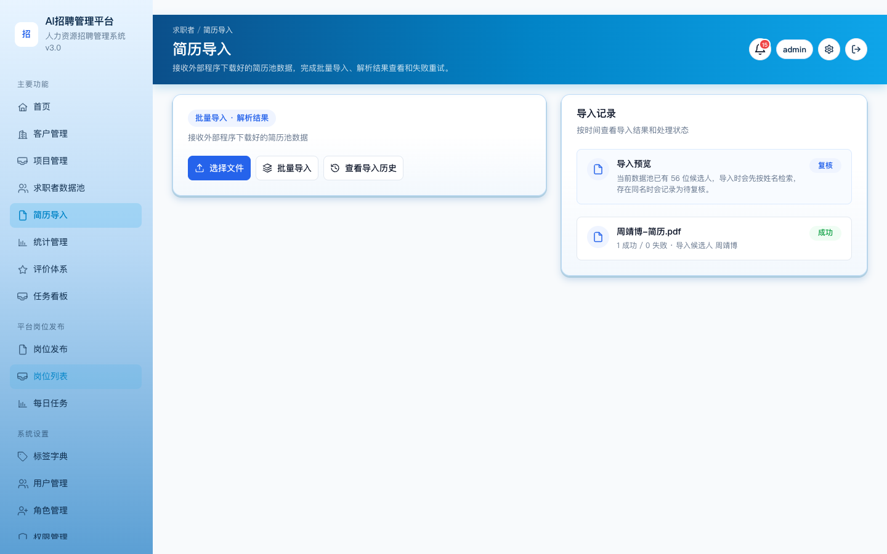

---

### 6.8 评价体系

| 项 | 说明 |
|----|------|
| **用途** | 沉淀候选人在推进与面试中的轮次评价，形成过程留痕 |
| **入口** | 侧栏「评价体系」→ `evaluations.html` |

**功能介绍**

| 能力 | 介绍 |
|------|------|
| 评价列表 | 候选人、关联岗位、轮次、等级、分值、内容、评价人、时间 |
| 筛选 | 按候选人姓名、等级（优秀/良好/一般/较差/不合格） |
| 新增评价 | 选择候选人、岗位、轮次，等级与分值联动 |
| 日常入口 | 岗位候选人页 / 候选人详情弹窗中也可写入；本页偏聚合查询 |

#### 📷 截图占位

| 项 | 说明 |
|----|------|
| **建议文件** | `outputs/manual-screenshots/06-08-evaluations.png` |
| **拍摄说明** | 评价体系列表：筛选区 + 评价表格（轮次、等级、分值、内容等列可见）。 |
| **可选补拍** | `06-08-evaluations-create.png`：新增评价弹窗。 |

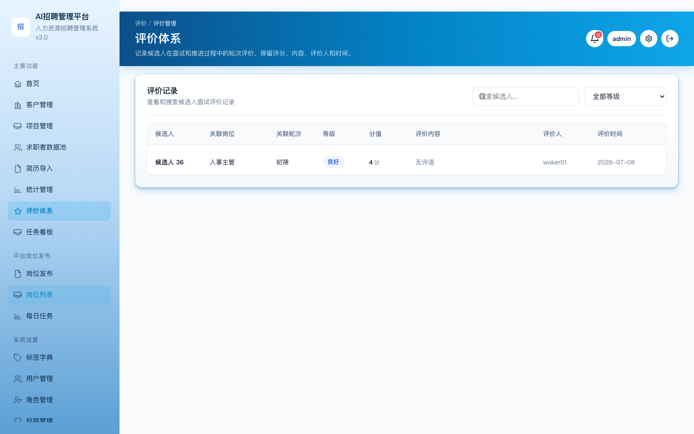

---

### 6.9 质保期管理

| 项 | 说明 |
|----|------|
| **用途** | 配置统一质保期，并监控已入职候选人的质保状态 |
| **入口** | 侧栏「质保期管理」→ `warranty.html`（需相应权限） |

**功能介绍**

| 能力 | 介绍 |
|------|------|
| 质保规则 | 统一配置 1 / 3 / 6 / 9 / 12 个月（默认常用 6 个月） |
| 监控列表 | 仅已入职：入职日期、质保期、剩余天数、状态 |
| 提醒 | 临近到期高亮 |
| 重新激活 | 可将入职时间更新为当天，重启质保计算 |
| 详情查看 | 查看质保相关明细 |

**质保相关状态（示意）**：质保中 / 质保到期 / 即将到期 / 可重新激活 等。

#### 📷 截图占位

| 项 | 说明 |
|----|------|
| **建议文件** | `outputs/manual-screenshots/06-09-warranty.png` |
| **拍摄说明** | 质保期管理页：质保规则配置区 + 已入职监控列表（剩余天数/状态列清晰可见）。 |
| **可选补拍** | 含「即将到期」高亮的一行样例。 |

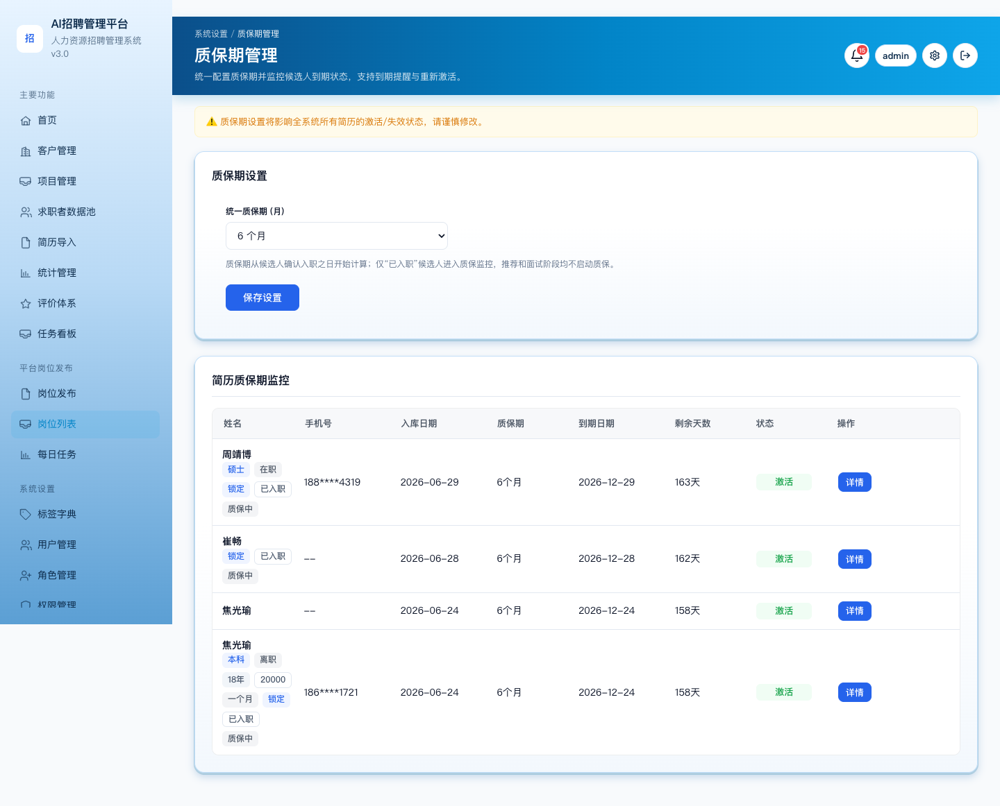

---

### 6.10 统计管理

| 项 | 说明 |
|----|------|
| **用途** | 经营指标与转化漏斗，支持按角色数据范围复盘 |
| **入口** | 侧栏「统计管理」→ `statistics.html` |

**功能介绍**

| 能力 | 介绍 |
|------|------|
| 六维 KPI | 求职者、客户、推荐、录用、协作用户、审计日志等；可下钻 |
| 趋势 | 近 30 天新增简历 / 推荐 / 录用 |
| 转化漏斗 | 推荐 → 面试 → 录用 → 留存 |
| 排行 | 团队排行、客户排行 |
| 分布图 | 如薪资分布等 |
| 权限过滤 | 管理员全量；组长授权范围；操作员个人相关 |

#### 📷 截图占位

| 项 | 说明 |
|----|------|
| **建议文件** | `outputs/manual-screenshots/06-10-statistics.png` |
| **拍摄说明** | 统计大屏首屏：KPI + 漏斗或趋势图至少一块完整可见（深色主题保持原样）。 |
| **可选补拍** | `06-10-statistics-drilldown.png`：点击某 KPI 后的下钻明细弹窗。 |

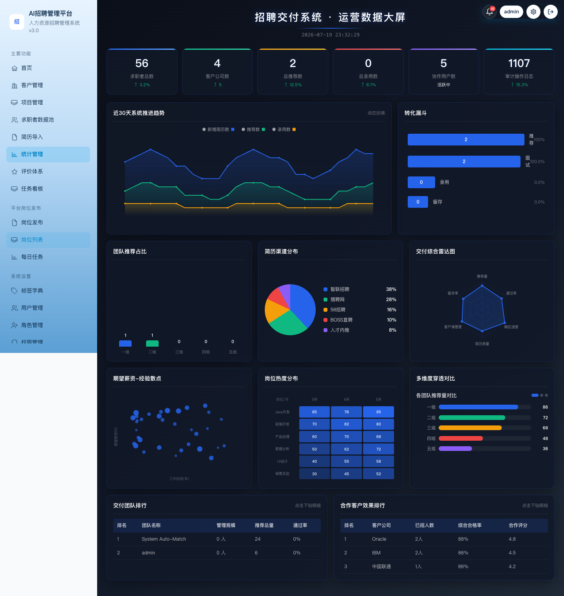

---

### 6.11 任务看板与通知

| 项 | 说明 |
|----|------|
| **用途** | 岗位协作待办中心 + 站内消息中心 |
| **入口** | 侧栏「任务看板」→ `notifications.html?tab=position-tasks`；顶栏铃铛 |

#### A. 岗位分配待办

| 能力 | 介绍 |
|------|------|
| 待办列表 | 岗位、项目、分配人/被分配人、时间、状态 |
| 接受 / 拒绝 | 操作员处理待办；可填说明 |
| 权限生效 | 接受后获得该岗位推荐等写权限 |
| 回执 | 组长收到处理结果通知 |

#### B. 站内通知

| 能力 | 介绍 |
|------|------|
| 消息列表 | 导入、评价、质保、AI、推荐、系统等事件 |
| 筛选 | 类型、已读、关键词、日期 |
| 已读管理 | 单条 / 批量标记已读 |

#### 📷 截图占位

| 项 | 说明 |
|----|------|
| **建议文件** | `outputs/manual-screenshots/06-11-position-tasks.png` |
| **拍摄说明** | 任务看板「岗位分配待办」Tab：待办列表 + 接受/拒绝按钮可见（可用操作员账号）。 |
| **建议补拍** | `06-11-notifications.png`：站内通知列表（含未读标记与筛选）。 |

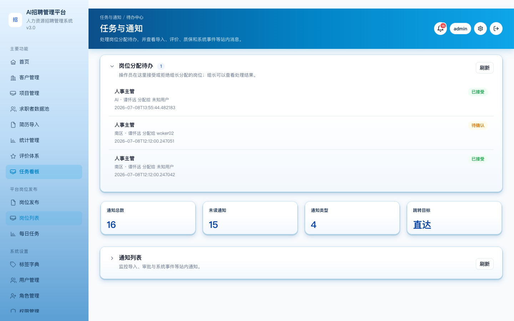
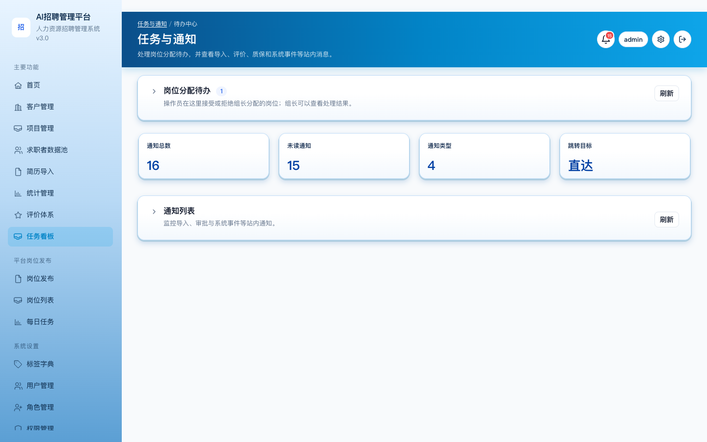

---

### 6.12 平台岗位发布（Recruit 抓取配置）

与交付侧「项目岗位」分离：本模块写入 `recruit` schema，供外部抓取程序读取。

#### 6.12.1 岗位发布

| 项 | 说明 |
|----|------|
| **入口** | 侧栏「岗位发布」→ `recruit-job-publish.html` |

**功能介绍**：发布抓取条件，包括岗位名称、工作地点、年龄上下限、学历、候选人活跃时间、每日打招呼上限、搜索关键词、是否参与抓取（有效 / 跳过）。

#### 6.12.2 岗位列表

| 项 | 说明 |
|----|------|
| **入口** | 侧栏「岗位列表」→ `recruit-job-list.html` |

**功能介绍**：维护 Recruit 岗位库；按有效状态、关键词筛选；编辑 / 删除；控制是否参与抓取。

#### 6.12.3 每日任务

| 项 | 说明 |
|----|------|
| **入口** | 侧栏「每日任务」→ `recruit-daily-tasks.html` |

**功能介绍**：按日期查看抓取任务统计——打招呼、索要简历、简历下载、简历回执；可按发布人、岗位查看。

**端到端链路（示意）**

```text
发布抓取岗位 → 外部程序执行 → 简历下载落库
 → AI Worker 解析结构化 → 数据池可见（触碰即入库）
```

#### 📷 截图占位

| 项 | 说明 |
|----|------|
| **建议文件** | `outputs/manual-screenshots/06-12-recruit-publish.png` |
| **拍摄说明** | 岗位发布表单页：岗位名、地点、年龄、学历、打招呼上限、有效/跳过等字段可见。 |
| **建议补拍** | `06-12-recruit-list.png`：Recruit 岗位列表；`06-12-recruit-daily.png`：每日任务统计表。 |

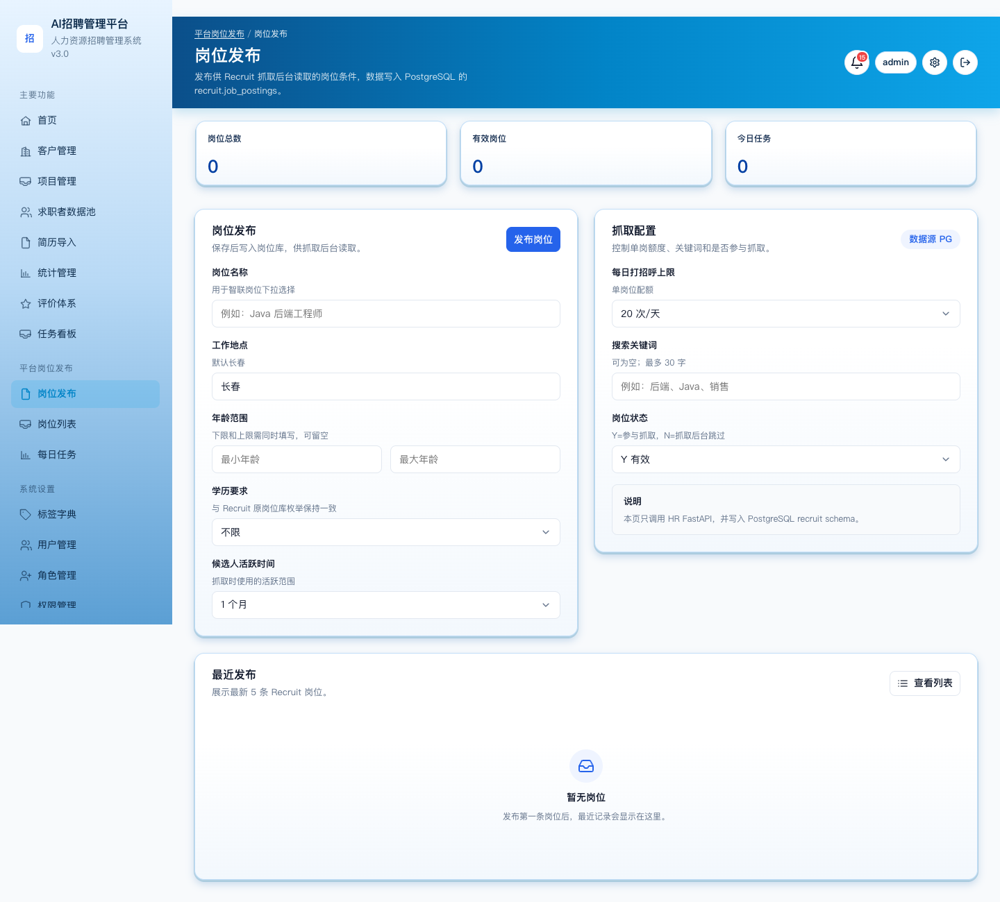
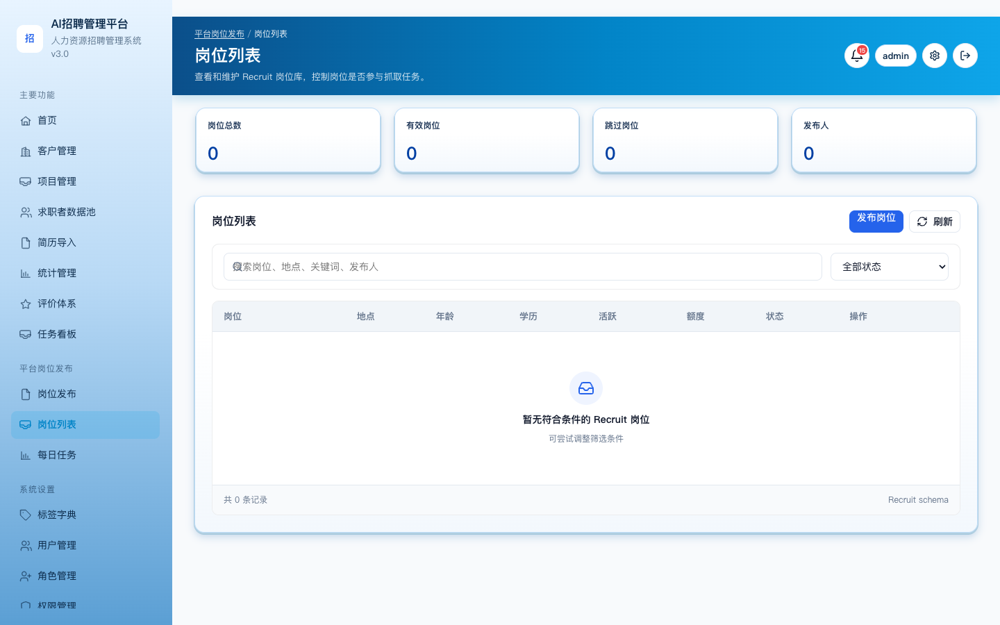
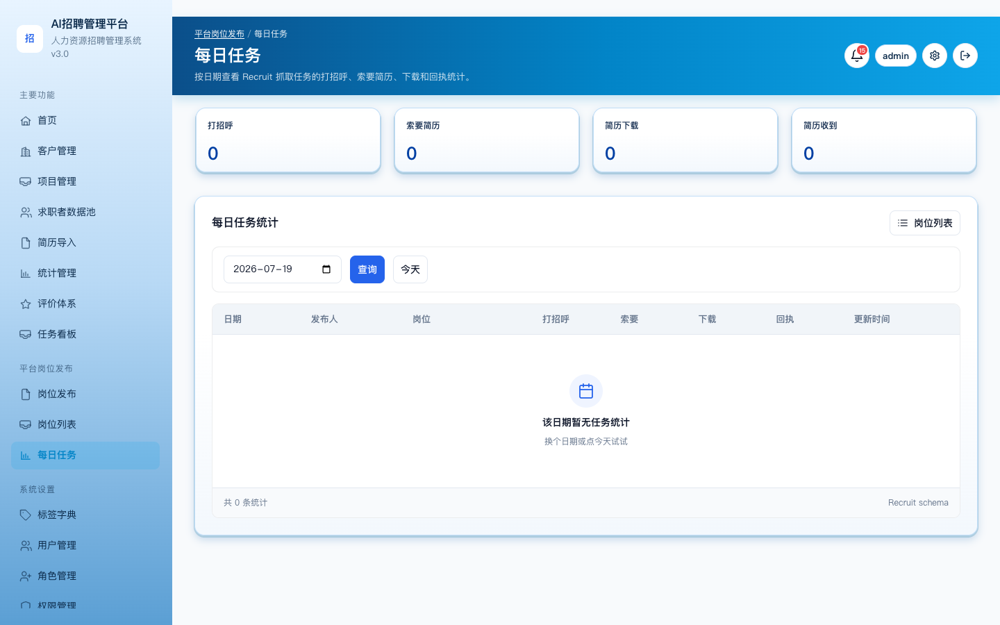

---

### 6.13 用户管理

| 项 | 说明 |
|----|------|
| **用途** | 管理内部账号、组织归属与启用状态 |
| **入口** | 侧栏「用户管理」→ `users.html` |

**功能介绍**

| 能力 | 介绍 |
|------|------|
| 账号 CRUD | 创建 / 编辑 / 删除 |
| 安全 | 重置密码、启用 / 停用 |
| 组织 | 角色、直属组长；组长行可展开直属组员 |
| 筛选 | 用户名/姓名、角色、状态 |
| 列表 | 联系方式、邮箱、最后登录等 |

#### 📷 截图占位

| 项 | 说明 |
|----|------|
| **建议文件** | `outputs/manual-screenshots/06-13-users.png` |
| **拍摄说明** | 用户管理列表：角色、状态、最后登录；若有组长展开组员，尽量拍到展开态。 |

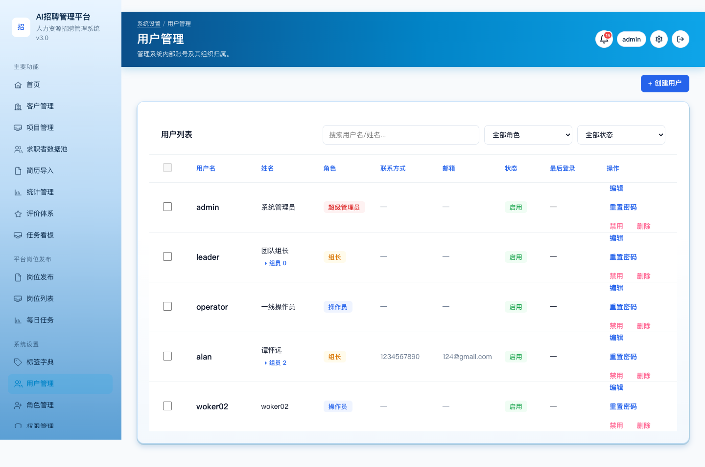

---

### 6.14 角色管理

| 项 | 说明 |
|----|------|
| **用途** | 定义角色及权限模板 |
| **入口** | 侧栏「角色管理」→ `roles.html` |

**功能介绍**

- 创建 / 编辑 / 删除角色；启用 / 停用
- 一站式授权弹窗：按模块勾选页面与操作权限
- 查看角色下用户数并可跳转用户列表过滤

预设角色通常包括：超级管理员、组长、操作员（名称以系统配置为准）。

#### 📷 截图占位

| 项 | 说明 |
|----|------|
| **建议文件** | `outputs/manual-screenshots/06-14-roles.png` |
| **拍摄说明** | 角色管理列表页。 |
| **建议补拍** | `06-14-roles-auth.png`：一站式授权弹窗（勾选模块权限矩阵可见）。 |

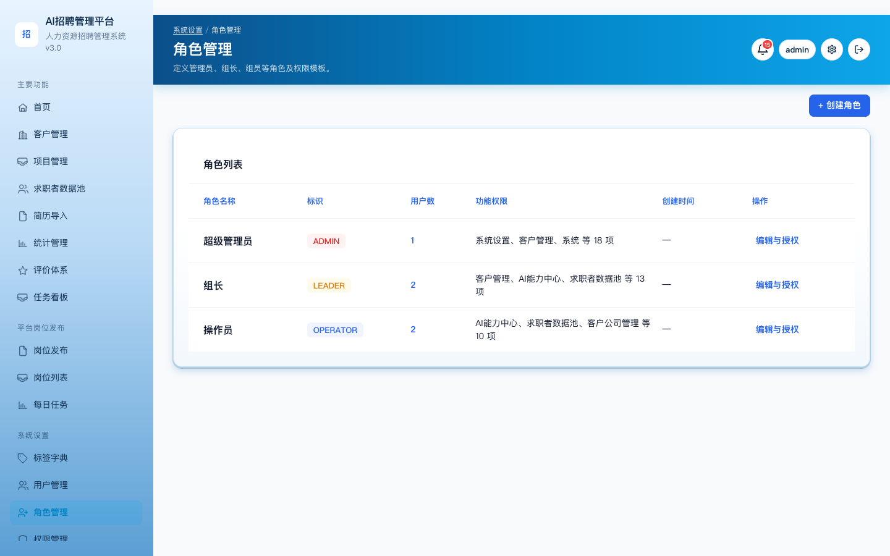
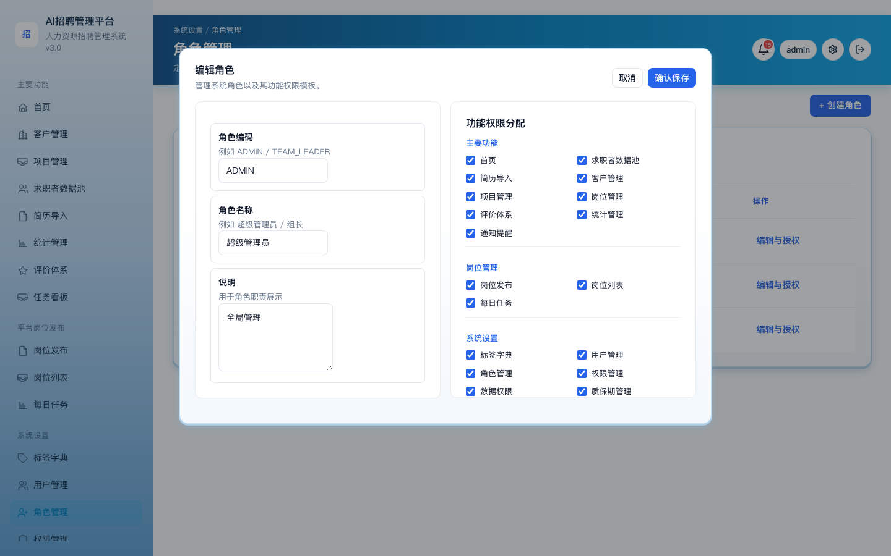

---

### 6.15 权限管理

| 项 | 说明 |
|----|------|
| **用途** | 维护功能权限矩阵与角色授权关系 |
| **入口** | 侧栏「权限管理」→ `permissions.html` |

**功能介绍**

- Tab：功能权限 / 数据权限说明
- 功能权限：权限标识、类型（menu / button / action）、模块、关联角色、启用状态
- 支持增删改角色-权限绑定

#### 📷 截图占位

| 项 | 说明 |
|----|------|
| **建议文件** | `outputs/manual-screenshots/06-15-permissions.png` |
| **拍摄说明** | 权限管理「功能权限」矩阵：权限标识、类型、模块、关联角色列可见。 |

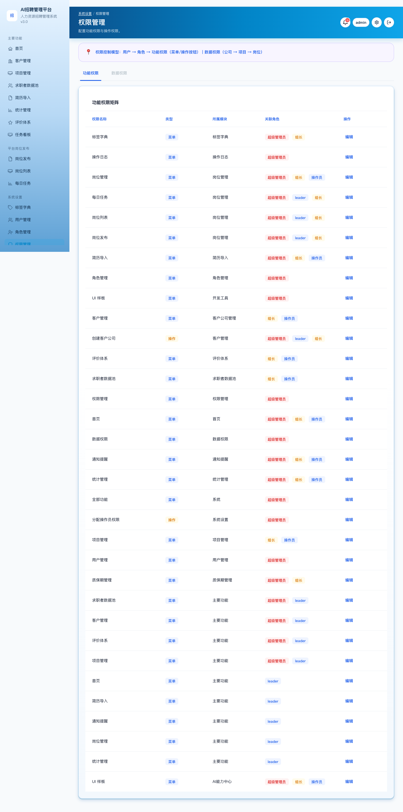

---

### 6.16 数据权限

| 项 | 说明 |
|----|------|
| **用途** | 配置可见的客户 / 项目 / 岗位数据范围 |
| **入口** | 侧栏「数据权限」→ `data-permissions.html` |

**功能介绍**

- 按组长 / 操作员视角管理授权
- 范围类型：company / project / position
- 启用 / 停用、移除分配
- 与岗位分配任务联动：操作员需接受岗位后，推荐等写权限才真正可用

#### 📷 截图占位

| 项 | 说明 |
|----|------|
| **建议文件** | `outputs/manual-screenshots/06-16-data-permissions.png` |
| **拍摄说明** | 数据权限页：组长/操作员 Tab + 范围类型（公司/项目/岗位）分配列表。 |

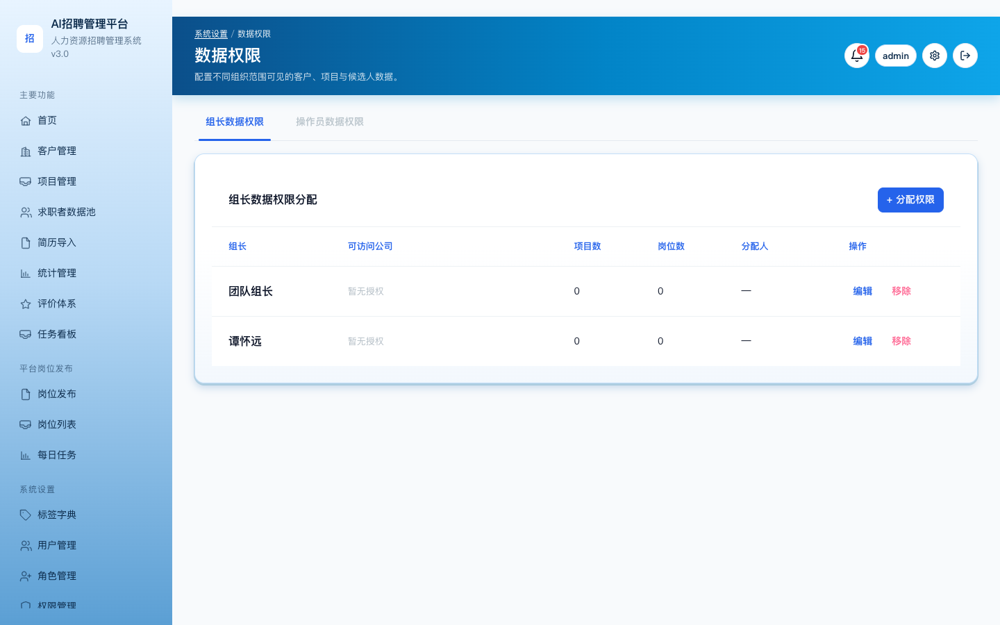

---

### 6.17 标签字典

| 项 | 说明 |
|----|------|
| **用途** | 统一标签口径，服务列表展示与快捷搜索 |
| **入口** | 侧栏「标签字典」→ `dictionary.html` |

**功能介绍**

| 能力 | 介绍 |
|------|------|
| 标签字段配置 | 按候选人 / 岗位 / 项目 / 客户等对象，配置字段 → 展示名 → 标签样式 |
| 列表生效 | 数据池、岗位候选人、质保等页面按配置展示系统标签 |
| 热词管理 | 文案、排序、启用；数据池「猜你想搜」仅展示已启用热词 |

#### 📷 截图占位

| 项 | 说明 |
|----|------|
| **建议文件** | `outputs/manual-screenshots/06-17-dictionary.png` |
| **拍摄说明** | 标签字典页：标签字段配置列表（对象类型、字段、样式）清晰可见。 |
| **可选补拍** | `06-17-dictionary-hotwords.png`：热词管理区域。 |

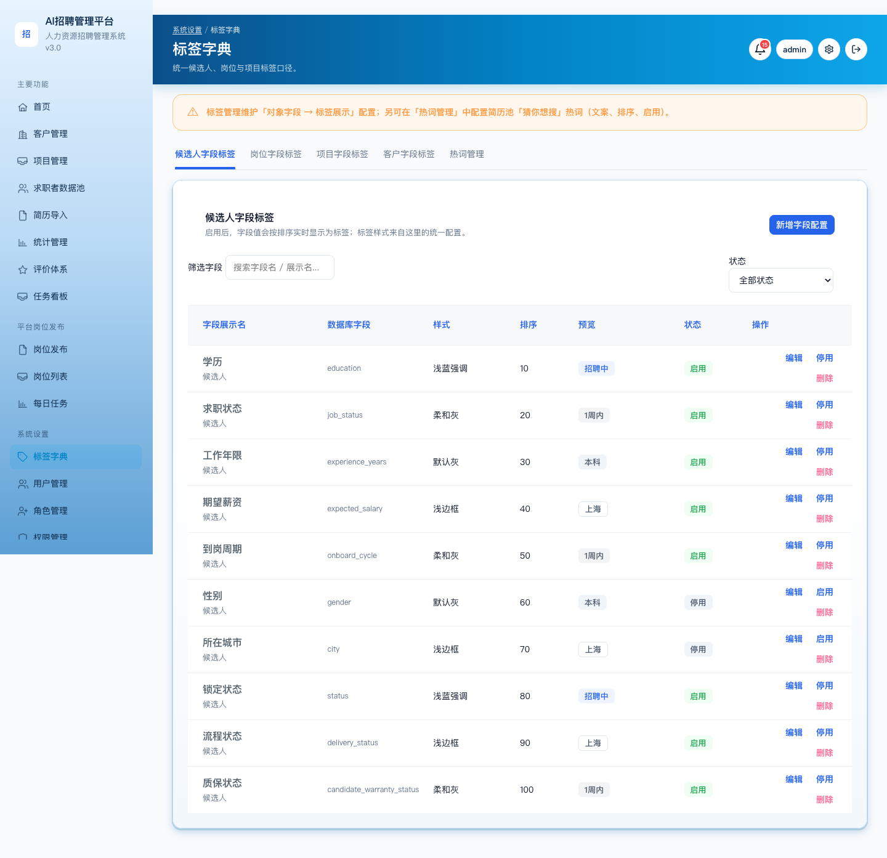

---

### 6.18 操作日志

| 项 | 说明 |
|----|------|
| **用途** | 关键操作审计留痕，满足合规与问题追溯 |
| **入口** | 侧栏「操作日志」→ `logs.html`（通常仅超级管理员） |

**功能介绍**

| 能力 | 介绍 |
|------|------|
| KPI | 操作总数及导入 / 推荐 / 权限等分类过滤 |
| 筛选 | 操作人、模块、动作、对象、结果、关键词、日期范围 |
| 导出 | 当前结果导出 CSV |
| 覆盖范围 | 导入、推荐、权限变更、导出、登录、改密等 |

#### 📷 截图占位

| 项 | 说明 |
|----|------|
| **建议文件** | `outputs/manual-screenshots/06-18-logs.png` |
| **拍摄说明** | 操作日志页：KPI + 筛选区 + 日志表格；可露出导出 CSV 按钮。 |

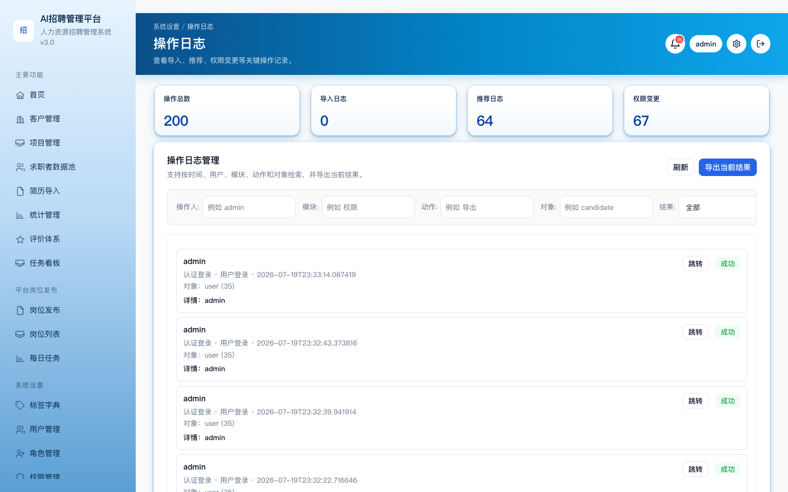

---

### 6.19 AI 能力中心

| 项 | 说明 |
|----|------|
| **用途** | 集中发起与查看 AI 相关任务 |
| **入口** | `ai-center.html`（面包屑可达；可不在侧栏常驻） |

**功能介绍**

| 能力 | 介绍 |
|------|------|
| 任务类型 | 简历解析、JD 生成、简历匹配、抓取简历等 |
| 任务列表 | 创建任务、查看最近结果、刷新状态 |
| 数据范围 | 普通用户通常仅见自己创建的任务 |
| 关联能力 | 数据池 AI 检索、JD 智能建岗、后台 resume parser worker 解析 Recruit 下载简历 |

#### 📷 截图占位

| 项 | 说明 |
|----|------|
| **建议文件** | `outputs/manual-screenshots/06-19-ai-center.png` |
| **拍摄说明** | AI 能力中心：任务类型入口 + 最近任务列表。 |

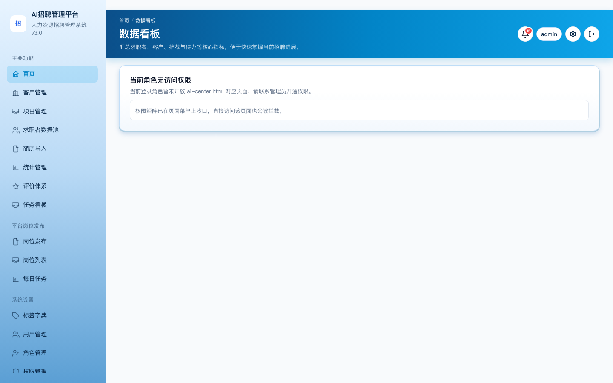

---

### 6.20 系统配置

| 项 | 说明 |
|----|------|
| **用途** | 系统级参数与邮件通道配置 |
| **入口** | `system-config.html` |

**功能介绍**

- 系统名称、水印、日志保留等参数
- 邮件 SMTP / 发件人配置与连接测试（候选人详情发信依赖此配置）

#### 📷 截图占位

| 项 | 说明 |
|----|------|
| **建议文件** | `outputs/manual-screenshots/06-20-system-config.png` |
| **拍摄说明** | 系统配置页：系统参数区 + 邮件配置区（敏感口令可打码）。 |

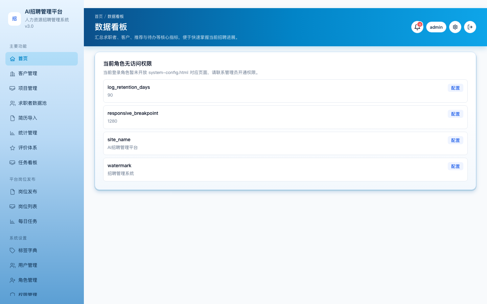

---

### 6.21 个人设置

| 项 | 说明 |
|----|------|
| **用途** | 个人账号安全（修改密码） |
| **入口** | 顶栏用户区 → 设置 → `settings.html` |

**功能介绍**：校验当前密码后设置新密码；变更写入审计日志。

#### 📷 截图占位

| 项 | 说明 |
|----|------|
| **建议文件** | `outputs/manual-screenshots/06-21-settings.png` |
| **拍摄说明** | 个人设置改密页：当前密码 / 新密码 / 确认密码表单完整可见。 |

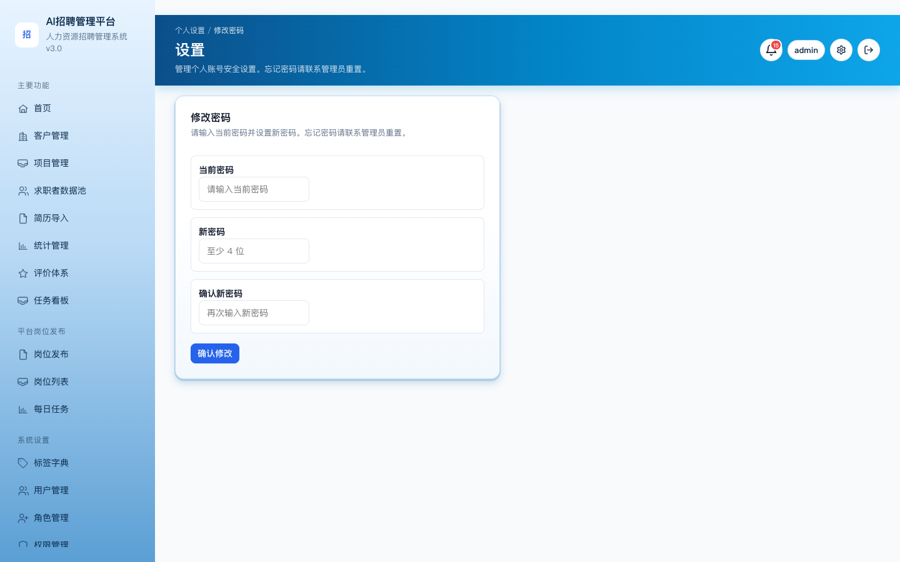

---

### 6.22 开发工具（非业务交付）

| 模块 | 入口 | 介绍 |
|------|------|------|
| 数据探针 | `db-explorer.html` | 直接预览 PostgreSQL 物理表，辅助排查；可识别 recruit 表 |
| UI 样板 | `ui-kit.html` | 设计令牌、组件与标签色板，作为页面视觉验收基准 |

#### 📷 截图占位（可选，对客户手册可不放）

| 项 | 说明 |
|----|------|
| **建议文件** | `outputs/manual-screenshots/06-22-db-explorer.png` / `06-22-ui-kit.png` |
| **拍摄说明** | 数据探针选表预览一屏；UI 样板色板与组件一屏。仅内部培训需要时贴图。 |

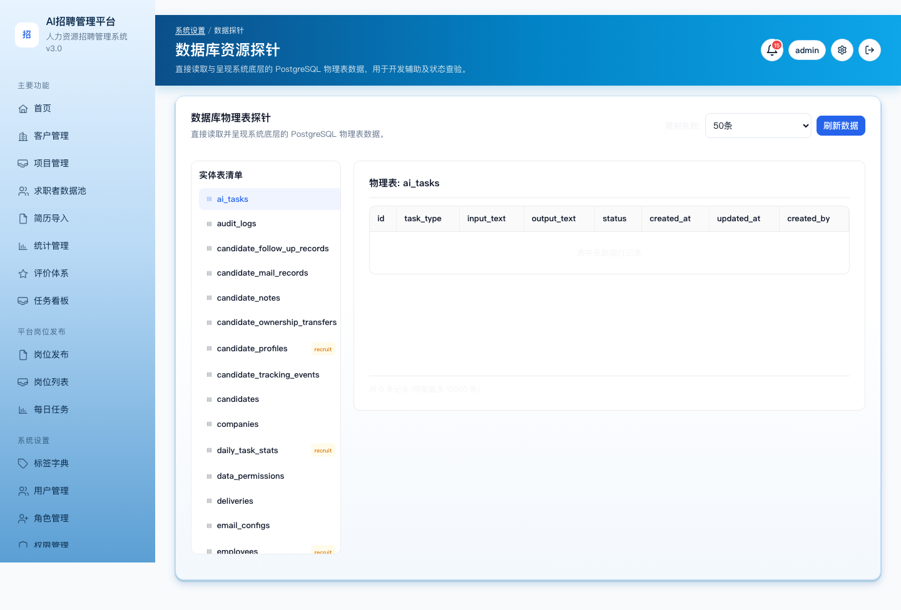
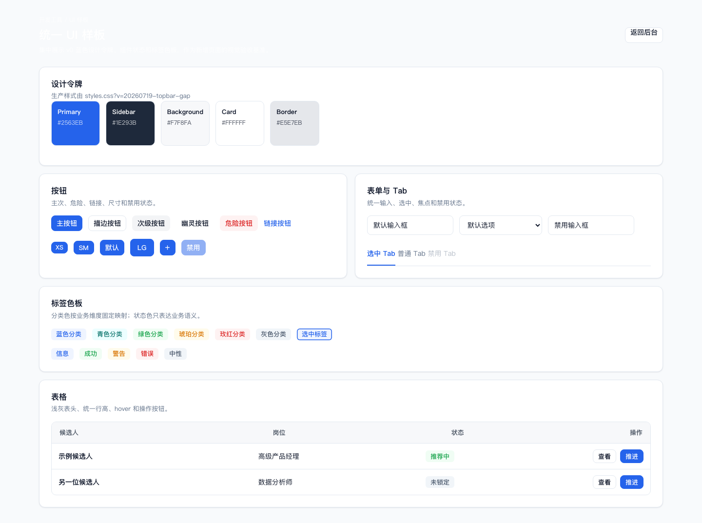

---

## 7. 候选人三维状态与关键规则

系统用**三个维度**描述候选人，避免把「锁定」与「交付进度」混为一谈：

| 维度 | 字段含义 | 典型取值 | 谁驱动 |
|------|----------|----------|--------|
| 锁定 | 是否被岗位占用 | 未锁定 / 锁定 | **仅**由是否存在推荐关系决定，不可手工改 |
| 交付进度 | 推进到哪一步 | 未推荐 / 已推荐 / 面试中 / 未录用 / 已入职 | 推荐状态 + 面试跟踪联动 |
| 质保 | 入职后稳定期 | 空 / 质保中 / 质保到期 等 | 仅「已入职」且入职日期有效时计算 |

**关键硬规则（产品约束）**

1. 每个岗位最多同时锁定 **10** 名候选人。
2. **已入职**候选人的推荐关系不可移除。
3. 项目下全部岗位均达到「已入职人数 ≥ 招聘人数」时，项目自动「招聘完毕」。
4. 确认入职时需能解析出关联的公司与岗位信息。
5. 菜单与按钮按角色功能权限动态显示；写操作仍受数据权限与岗位接受状态约束。

---

## 8. 简历来源与隐式入库

系统采用**内外解耦 + 触碰即入库（懒加载）**：

1. 外部抓取程序只写入 `recruit` 相关表，不主动调用交付系统接口。
2. 数据池列表通过关联查询，把尚未入库的外部简历一并展示（来源可标为简历库等）。
3. 业务员对外部简历执行锁定、编辑、发信等实质性操作时，后端自动在本地业务库创建正式候选人记录，再继续完成该操作——用户无需点「导入」按钮。

手工 PDF 导入仍走「简历导入」模块，作为补录通道。

---

## 9. 附录：页面与导航对照表

### 9.1 侧栏「主要功能」

| 菜单 | 页面 | 一句话 |
|------|------|--------|
| 首页 | `dashboard.html` | 交付与经营概览 |
| 客户管理 | `customers.html` | 甲方公司主数据 |
| 项目管理 | `projects.html` | 项目 + 岗位（双 Tab） |
| 求职者数据池 | `candidates.html` | 找人与推荐工作台 |
| 简历导入 | `import.html` | 手工 PDF 入库 |
| 统计管理 | `statistics.html` | 漏斗与绩效大屏 |
| 评价体系 | `evaluations.html` | 评价聚合查询 |
| 任务看板 | `notifications.html` | 岗位待办 + 通知 |

### 9.2 侧栏「平台岗位发布」

| 菜单 | 页面 | 一句话 |
|------|------|--------|
| 岗位发布 | `recruit-job-publish.html` | 配置抓取岗位 |
| 岗位列表 | `recruit-job-list.html` | 维护抓取岗位库 |
| 每日任务 | `recruit-daily-tasks.html` | 抓取任务日统计 |

### 9.3 侧栏「系统设置」

| 菜单 | 页面 | 一句话 |
|------|------|--------|
| 标签字典 | `dictionary.html` | 标签与热词口径 |
| 用户管理 | `users.html` | 账号与组织 |
| 角色管理 | `roles.html` | 角色与权限模板 |
| 权限管理 | `permissions.html` | 功能权限矩阵 |
| 数据权限 | `data-permissions.html` | 数据可见范围 |
| 质保期管理 | `warranty.html` | 质保规则与监控 |
| 操作日志 | `logs.html` | 审计日志 |

### 9.4 其他已实现页面

| 页面 | 说明 |
|------|------|
| `login.html` | 登录 |
| `index.html` | 跳转仪表盘 |
| `position-candidates.html` | 岗位候选人工作台 |
| `ai-center.html` | AI 任务中心 |
| `system-config.html` | 系统与邮件配置 |
| `settings.html` | 个人改密 |
| `db-explorer.html` / `ui-kit.html` | 开发工具 |

---

## 10. 文档维护说明

- 功能变更后，应同步更新本手册对应章节，并在 `progress.md` 留痕。
- 操作步骤级说明优先维护 `outputs/用户操作手册.md`，避免两份文档重复堆砌「点击路径」。
- 业务边界与对象定义以 `outputs/猎头招聘交付系统-原型理解框架.md` 与正式需求 DOCX 为准；若冲突，以产品最终需求文档为准。
- **截图维护**：新图放入 `outputs/manual-screenshots/`，按第 6 章各节建议文件名命名；放入后取消对应 `<!-- ![...] -->` 注释即可在预览中显示。

---

*全文完*
